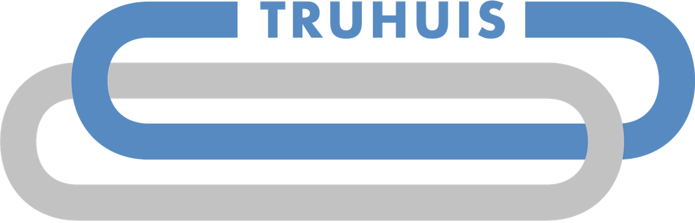

# Truhuis Smart Contracts

 

</a>

 

## Technology Stack & Tools

- [Solidity](https://docs.soliditylang.org/en/latest/index.html) (High-level language for implementing smart contracts)
- [Ethereum](https://ethereum.org/en/) (Decentralized, open-source blockchain with smart contract functionality)
- [Chainlink](https://docs.chain.link/) (Allows securely connect smart contracts with off-chain data and services)
- [OpenZeppelin](https://docs.openzeppelin.com/contracts/4.x/) (A library for secure smart contract development)
- [Brownie](https://eth-brownie.readthedocs.io/en/stable/toctree.html#) (Python development framework for Ethereum)
- [IPFS](https://docs.ipfs.io/) (IPFS is a distributed system for storing and accessing files, websites, applications, and data)
- [Filecoin](https://docs.filecoin.io/) (Filecoin is a peer-to-peer network that stores files, with built-in economic incentives to ensure files are stored reliably over time)
- [Pinata](https://docs.pinata.cloud/) (Cloud-based InterPlanetary File System service provider; no need to run IPFS node by yourself)
- [Hardhat](https://hardhat.org/hardhat-network/) (Local Blockchain environment)
- [Infura](https://docs.infura.io/infura/) (Blockchain API to connect to a Testnet or a Mainnet; no need to run own Blockchain node)
- [Alchemy](https://docs.alchemy.com/alchemy/) (Blockchain API to connect to a Testnet or a Mainnet; no need to run own Blockchain node)

## Requirements For Initial Setup
Please install or have installed the following:

- [NodeJS and NPM](https://nodejs.org/en/download/)
- [Python](https://www.python.org/downloads/)
